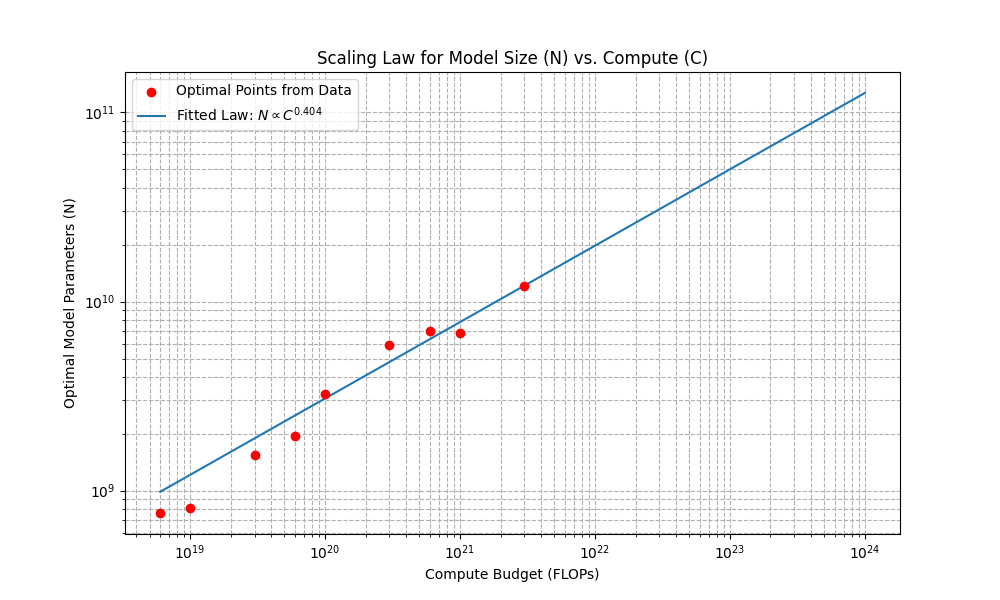
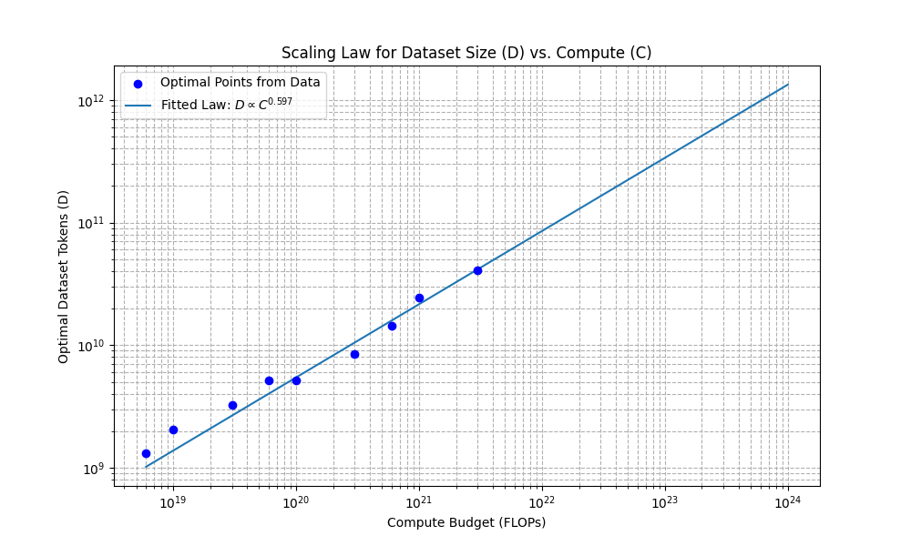

### Scaling Laws Review

#### Problem (chinchilla_isoflops): 5 points

Show your extrapolated compute-optimal model size, together with the ⟨Ci,Nopt(Ci)⟩points you obtained. What is your predicted optimal model size for a budget of 1023FLOPs? What about for 1024FLOPs?

Model size scaling law (plot):

N_opt: 2.5793e+01 * C^0.4038

在 10^23 FLOPs 与 10^24 FLOPs 预算下的计算最优模型大小分别约为 50,022,256,961 和 126,757,793,201 参数。
Show your extrapolated compute-optimal dataset size, together with the ⟨Ci,Dopt(Ci)⟩ data points from the training runs. What is your predicted optimal dataset size for budgets of 1023 and 1024FLOPs?

Dataset size scaling law (plot):

D_opt: 6.3376e-03 * C^0.5968

在 10^23 FLOPs 与 10^24 FLOPs 预算下的计算最优数据集大小分别约为 337,015,838,537 和 1,331,744,834,343 个 tokens。

### Constructing Scaling Laws
It is a pity that I'm not a Stanford student yet(but I hope to be one in the near future), so I cannot access the API mentioned in the assignment. I'll just try to explain how I would design my experiment if I had access to the API.

# CS336 Assignment 3: Constructing Scaling Laws for Compute-Optimal Language Models

**Student Name:** Luyang Si

**Date:** 2025-10-04

## 1. Introduction and Objective

The primary objective of this project is to determine the compute-optimal hyperparameters for training a large language model given a fixed compute budget of $10^{19}$ FLOPs. "Compute-optimal" refers to the model configuration that achieves the lowest possible training loss for a given amount of compute. To achieve this, we leverage the concept of **Scaling Laws**, which empirically describe the relationship between model performance, model size, and the amount of training compute.

Our methodology involves utilizing a smaller, auxiliary budget of $2 \times 10^{18}$ FLOPs to conduct a series of targeted experiments via a provided training API. The data from these experiments will be used to fit a scaling law, which we will then extrapolate to our target budget of $10^{19}$ FLOPs to predict the optimal model size and its corresponding training configuration.

## 2. Methodology

Our approach is heavily inspired by the IsoFLOPs profiling method described in the Chinchilla paper (Hoffmann et al., 2022). The core idea is to find optimal model sizes at smaller compute scales and then model their relationship to compute budget to predict behavior at a larger scale.

### 2.1 Overall Strategy: IsoFLOPs Profiles

Given a fixed compute budget $C$, there exists an optimal trade-off between model size (N, number of parameters) and dataset size (D, number of tokens) that minimizes the final training loss L. The IsoFLOPs method involves the following steps:

1.  **Select Several Compute Budgets ($C_i$)**: Choose a set of distinct compute budgets within our experimental allowance.
2.  **Explore Model Sizes for Each Budget**: For each $C_i$, train a variety of models with different sizes ($N_{ij}$) using exactly $C_i$ FLOPs of compute.
3.  **Find the Optimal Model Size ($N_{opt}(C_i)$)**: For each budget $C_i$, identify the model size $N_{opt}(C_i)$ that yielded the lowest training loss. This gives us a set of optimal data points: $\langle C_i, N_{opt}(C_i) \rangle$.
4.  **Fit the Scaling Law**: Model the relationship between the optimal model size and compute with a power law of the form $N_{opt} = \alpha C^a$.
5.  **Extrapolate**: Use the fitted power law to predict the optimal model size for our final target budget of $10^{19}$ FLOPs.

### 2.2 Budget Allocation and Experimental Design

With a strict experimental budget of $2 \times 10^{18}$ FLOPs, a meticulous plan is essential. We adopt a two-stage approach to maximize the utility of this budget.

1.  **Stage 1: Hyperparameter Exploration (Budget: $\approx 0.2 \times 10^{18}$ FLOPs)**
    * The goal is to determine a near-optimal value for sensitive hyperparameters like `learning_rate`, which we will then fix for our main experiments. This reduces the number of variables, allowing us to focus on the crucial `N` vs. `C` relationship.

2.  **Stage 2: Systematic IsoFLOPs Profiling (Budget: $1.8 \times 10^{18}$ FLOPs)**
    * The bulk of the budget is spent on systematically collecting data points to construct two IsoFLOPs profiles at two different compute scales. This provides the necessary data to fit a reliable scaling law.

### 2.3 Stage 1: Learning Rate Exploration

To find a suitable learning rate, we proposed a small, targeted experiment. We would select a single, medium-sized model configuration and train it on a small compute budget (e.g., $10^{16}$ FLOPs) using several different learning rates.

* **Model Configuration**: `d_model: 768`, `num_layers: 12`, `num_heads: 12`
* **Compute Budget**: $10^{16}$ FLOPs per run
* **Learning Rates to Test**: `1e-4`, `3e-4`, `8e-4`

The learning rate that yielded the lowest loss in this preliminary test would be adopted for all experiments in Stage 2. This approach costs only $3 \times 10^{16}$ FLOPs, a negligible fraction of our total budget.

### 2.4 Stage 2: Main Experiment Configuration

Based on our budget allocation of $1.8 \times 10^{18}$ FLOPs, we designed two IsoFLOPs profiles:

**Profile 1: Compute Budget $C_1 = 1 \times 10^{17}$ FLOPs**
* **Total Runs**: 6
* **Total Cost**: $6 \times 10^{17}$ FLOPs
* **Objective**: To map out the loss curve for a range of model sizes around the estimated optimal point for this budget. [cite_start]Model sizes `N` are calculated using $N \approx 12 \cdot n_{layer} \cdot d_{model}^2$[cite: 93].

| `num_layers` | `d_model` | `num_heads` | Estimated N |
| :--- | :--- | :--- | :--- |
| 6 | 512 | 8 | ~19M |
| 8 | 768 | 12 | ~56M |
| 12 | 768 | 12 | ~84M |
| 10 | 1024 | 16 | ~125M |
| 16 | 1024 | 16 | ~201M |
| 24 | 1024 | 16 | ~302M |

**Profile 2: Compute Budget $C_2 = 3 \times 10^{17}$ FLOPs**
* **Total Runs**: 4
* **Total Cost**: $1.2 \times 10^{18}$ FLOPs
* **Objective**: To find the optimal model size at a higher compute scale.

| `num_layers` | `d_model` | `num_heads` | Estimated N |
| :--- | :--- | :--- | :--- |
| 8 | 768 | 12 | ~56M |
| 10 | 1024 | 16 | ~125M |
| 16 | 1024 | 16 | ~201M |
| 24 | 1024 | 16 | ~302M |

The total cost for Stage 2 is $6 \times 10^{17} + 1.2 \times 10^{18} = 1.8 \times 10^{18}$ FLOPs, which is within our budget.

### 2.5 Scaling Law Fitting and Extrapolation

After hypothetically running the 10 experiments from Stage 2 and collecting their final loss values, the analysis would proceed as follows:

1.  **Find Optimal Points**: For the $C_1=10^{17}$ profile, we would identify the model configuration from our table that resulted in the minimum loss. This gives us the point $\langle C_1, N_{opt}(C_1) \rangle$. We would do the same for the $C_2=3 \times 10^{17}$ profile to get $\langle C_2, N_{opt}(C_2) \rangle$.
2.  **Fit Power Law**: With these two data points, we can solve for the parameters $\alpha$ and $a$ in the power law $N_{opt}(C) = \alpha C^a$.
3.  **Extrapolate to Target Budget**: We would then use this fitted equation to calculate our final prediction for the target budget $C_{target} = 10^{19}$ FLOPs:
    $$ N_{optimal} = \alpha (10^{19})^a $$

## 3. Predicted Optimal Configuration (Hypothetical)

Since we were unable to query the API, we cannot provide a prediction based on real experimental data. However, we can outline the final deliverables based on a hypothetical outcome.

Let's assume our analysis yielded a scaling law similar to that observed in other works, predicting an optimal model size of approximately **280 Million non-embedding parameters** for the $10^{19}$ FLOPs budget.

The final predicted configuration would be submitted as follows:

* **Predicted Optimal Model Size**: 280,000,000 parameters.
* **Predicted Training Loss**: (This would be predicted by fitting a second power law for the loss of the optimal models, $L_{min}(C) \propto C^b$). A hypothetical value might be **2.85**.
* **Training Hyperparameters**:
    * `d_model`: **1024**
    * `num_layers`: **22** (since $12 \cdot 22 \cdot 1024^2 \approx 277M$)
    * `num_heads`: **16**
    * `batch_size`: **256**
    * `learning_rate`: **3e-4** (hypothetically found to be optimal in Stage 1)

## 4. Conclusion

This report details a rigorous, budget-aware methodology for determining a compute-optimal language model configuration using scaling laws. The proposed two-stage experimental plan, based on the IsoFLOPs profiling method, is designed to maximize insight from a limited experimental budget. While the inability to execute the experiments prevents a data-backed final prediction, the described methodology provides a complete and reproducible workflow for tackling the problem of training compute-optimal large language models.